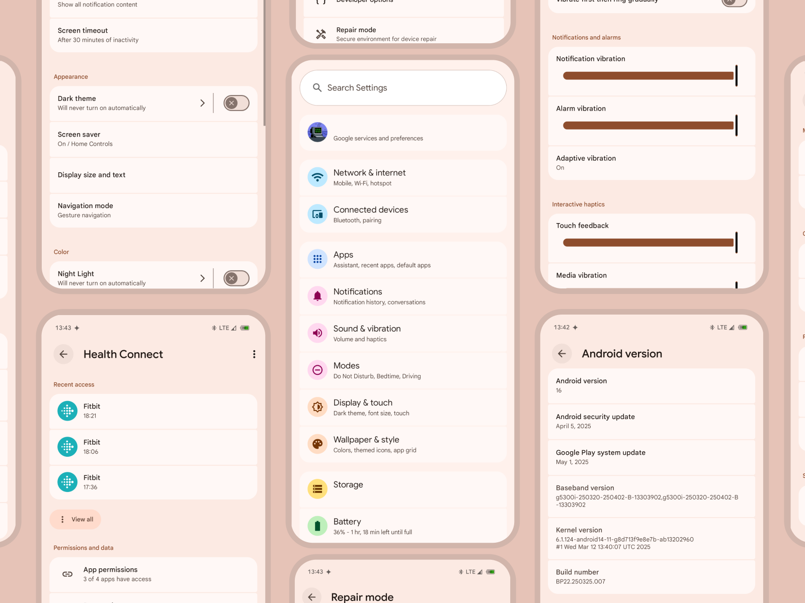

# Material 3 Expressive Theme

## What does it do?

Material 3 Expressive Theme is a module for LSPosed that changes boolean isExpressiveDesignEnabled from false to true. It has been tested on Android 15 QPR2(BP1A.250405.007, Android 16 Beta 3 and Android 16 Beta 4.

## Target Applications

This module is primarily intended for and tested with the following system components :

*   **Settings:** com.android.settings
*   **System UI:** com.android.systemui
*   **Permission Controller:** com.google.android.permissioncontroller, com.android.permissioncontroller
*   **Health Connect:** com.google.android.healthconnect.controller
*   **Repair Mode:** com.google.android.repairmode
*   **Device Diagnostics:** com.android.devicediagnostics
*   ...and potentially others using com.android.settingslib.

**Important:** 

While you can enable this module for *any* app in the LSPosed Manager scope settings, it will only modify behavior in apps that actually check for that specific boolean. For apps that don't check for it, the module will simply do nothing.

On Android 15 QPR2 use the previous 1.0 release.

## How to install

### Prerequisites

To use this module you must have one of the following (latest versions):
- [Magisk](https://github.com/topjohnwu/Magisk) with Zygisk enabled
    - IMPORTANT: DO NOT add apps that you want to spoof to Magisk's denyList as that will break the module.
- [KernelSU](https://github.com/tiann/KernelSU) with [ZygiskNext](https://github.com/Dr-TSNG/ZygiskNext) module installed
- [APatch](https://github.com/bmax121/APatch) with [ZygiskNext](https://github.com/Dr-TSNG/ZygiskNext) module installed

You must also have [LSPosed](https://github.com/mywalkb/LSPosed_mod) installed

### Installation

- Download the latest APK of Material 3 Expressive Theme from the [releases section](https://github.com/igorb200828/Android-16-Expressive-Theme/releases) and install it like any normal APK.
- Now open the LSPosed Manager and go to "Modules".
- "Material 3 Expressive Theme" should now appear in that list.
- Click on "Material 3 Expressive Theme" and enable the module by flipping the switch at the top that says "Enable module".
- Next, tick the other apps that you want the module to apply to. The recommended one's will be already selected.
- Force close the selected apps multiple times for the changes to fully apply or restart the device.

### Other

- The colorful background behind icons is only available from Android 16 Beta 4
- If you encounter problems with the theming in the selected apps like Permission Controller it is the styling problem of the app
- In Android 15 QPR2, the theme is incomplete. For instance, pages such as 'Security and Privacy' and 'Default apps' are not themed or are only partially themed.
- It's base hase been based on [PixelSpoof](https://github.com/RisenID/PixelSpoof). The code bypassing the check is original.

### Other Mods

- [Android 16 Desktop mode enabler](https://github.com/igorb200828/Android_16_Desktop_Experience_Enabler), enables the new desktop mode on Android 16 QPR1 Beta 1

### [Screenshots](https://github.com/igorb200828/Android-16-Expressive-Theme/tree/master/img)
